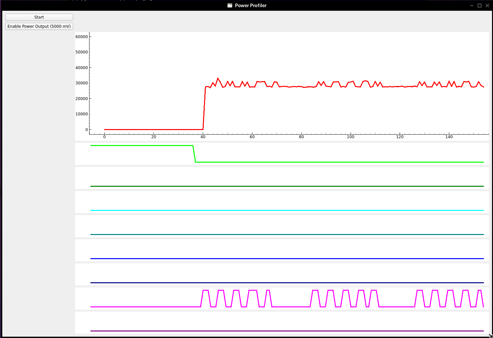

# November Status Update for Tom Jones

## **Reporting Period:** 2025-11-17 - 2025-11-25 (Week 47)

### Project: Improve FreeBSD Kernel Debugging
#### **Overall Status:** On Track
#### **Summary**

FreeBSD offers a variety of kernel debugging interfaces, the main interface
available on all systems is using the system console, typically via a graphics
interface. On modern system the graphics driver is routed via a GPU which
requires a lot of code to drive. This can lead to situations when the graphics
system crashes or the graphics output stops functioning where interactive
debugging is impossible or debugging at all isn't possible.

This project aims to provide a debugging mechanism that will work in the
absence of a functional graphics driver, first by updating and upstreaming xHCI
debug, by documenting and improving other debug interfaces and my adding
support for debugging interfaces in newer systems.

#### **Completed Tasks**

- [x] set up environment to examine usb transfer on freebsd using wireshark
- [x] split xhci debug loader support into more smaller pieces
- [x] Set up AMD AI 7 350 Framework mainboard
- [x] Verify functionality of DAM activator with AMD hardware

#### **Ongoing Tasks**
- [ ] Test loader support
- [ ] Test kernel support
- [ ] Track down stall in host mode driver
- [ ] Debug framework SOC uart issues

### Project: Improve FreeBSD Power Usage 
#### **Overall Status:** On Track
#### **Summary**

FreeBSD runs on devices from high end servers through laptops and desktops down
to small embedded systems. On all systems it is a benefit if FreeBSD can use
the lowest practical amount of energy while still providing performance
responsive to user requests.

The foundation is look at various power management technologies in modern
devices with a focus on laptops. 

This project aims to improve the introspectability of FreeBSD systems to better
understand which systems are contributing most to power usage. The initial
tasks in this activity look at creating tools and measurements to help design
the tools to investigate power usage. The ultimate goal of the project is to
meet the '8 hour working time' goal of the laptop project.

#### **Completed Tasks**

- [x] Use existing tools to investigate a simple target
- [x] Port existing tools to work on FreeBSD
- [x] Create a minimal interface to user tools dynamically without proprietary eletron apps.
    - [powerprofilerui](https://codeberg.org/tj/powerprofilerui/src/branch/tj/import)

#### **Ongoing Tasks**
- [ ] Design a power profile and control board for usb-c devices
- [ ] Extend perfetto to support freebsd events

## **Reporting Period:** 2025-11-10 - 2025-11-16 (Week 46)

### Project: Improve FreeBSD Kernel Debugging
#### **Overall Status:** On Track
#### **Summary**

FreeBSD offers a variety of kernel debugging interfaces, the main interface
available on all systems is using the system console, typically via a graphics
interface. On modern system the graphics driver is routed via a GPU which
requires a lot of code to drive. This can lead to situations when the graphics
system crashes or the graphics output stops functioning where interactive
debugging is impossible or debugging at all isn't possible.

This project aims to provide a debugging mechanism that will work in the
absence of a functional graphics driver, first by updating and upstreaming xHCI
debug, by documenting and improving other debug interfaces and my adding
support for debugging interfaces in newer systems.

#### **Completed Tasks**

- [x] Build debug activator and test functionality with xhci debug
    This showed that the adapter doesn't require rd/rd to funcation and just a
    passive usb-c 3.0 adapter can fill this role
- [x] get xhci debug working with usb-c ports
- [x] outline parts for usb-c power control board and debug activator
- [x] background on port control ics and their use with usb-c
    this was thought a requirement to do usb-c xhci debug, but it appear to not
    be the case

#### **Ongoing Tasks**
- [ ] Test loader support
- [ ] Test kernel support
- [ ] Track down stall in host mode driver

#### **Next Steps**

- [ ] Resolve stall in host mode driver

### Misc

- background on power analysis with perfetto
- background: summary of differences between ftrace (linux) and dtrace

## **Reporting Period:** 2025-10-27 - 2025-11-09 (Week 45)

### Project: Improve FreeBSD Kernel Debugging
#### **Overall Status:** On Track
#### **Summary**

FreeBSD offers a variety of kernel debugging interfaces, the main interface
available on all systems is using the system console, typically via a graphics
interface. On modern system the graphics driver is routed via a GPU which
requires a lot of code to drive. This can lead to situations when the graphics
system crashes or the graphics output stops functioning where interactive
debugging is impossible or debugging at all isn't possible.

This project aims to provide a debugging mechanism that will work in the
absence of a functional graphics driver, first by updating and upstreaming xHCI
debug, by documenting and improving other debug interfaces and my adding
support for debugging interfaces in newer systems.

#### **Completed Tasks**

- [x] Compare linux/freebsd host mode driver performance to understand stall
- [x] Build debug activator and test functionality with framework EC

#### **Ongoing Tasks**
- [ ] Test loader support
- [ ] Test kernel support
- [ ] Build debug activator and test for xhci debug support
- [ ] Track down stall in host mode driver

#### **Next Steps**

- [ ] Debug loader stall wth xhci debug support on linux qemu kvm
- [ ] Resolve stall in host mode driver
